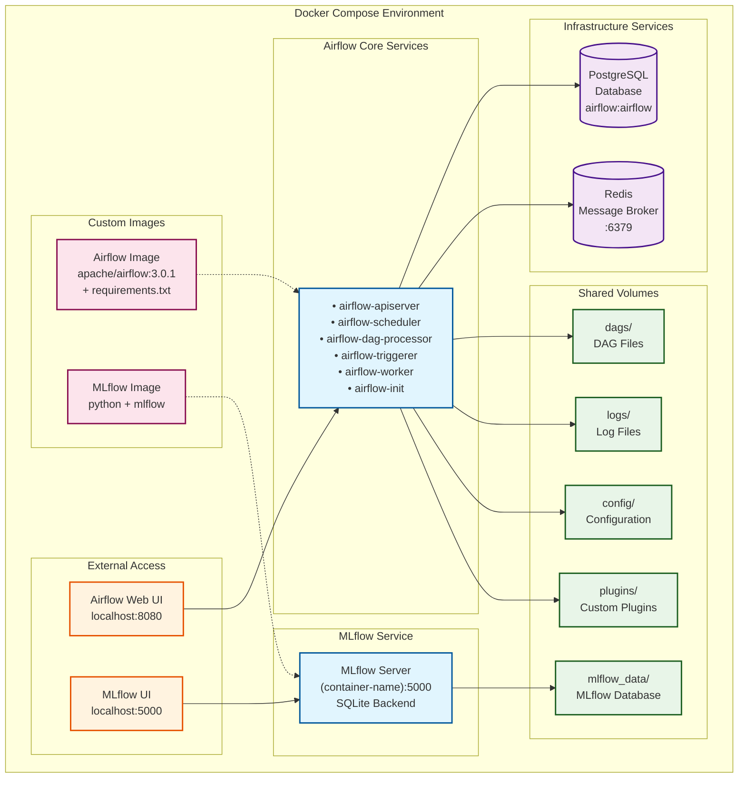
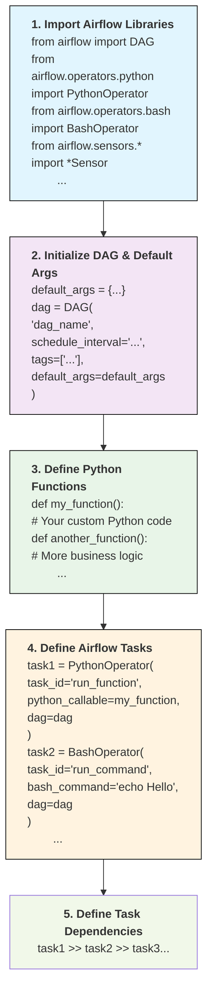

# Implementing an Airflow + MLFlow Lab

# Table of Contents

- [Implementing an Airflow + MLFlow Lab](#implementing-an-airflow--mlflow-lab)
- [Table of Contents](#table-of-contents)
	- [Installation Notes](#installation-notes)
		- [Environment:](#environment)
		- [Airflow](#airflow)
		- [MLFlow](#mlflow)
		- [Overall Architecture](#overall-architecture)
- [More detailed notes](#more-detailed-notes)
	- [Environment \& Requirements](#environment--requirements)
	- [Usage](#usage)
		- [First Run - Initializing the environment](#first-run---initializing-the-environment)
		- [Regular Usage](#regular-usage)
			- [Environment](#environment-1)
			- [Web UIs](#web-uis)
			- [Running Airflow CLI Commands](#running-airflow-cli-commands)
	- [(!In Construction!) Functional Part (!In Construction!)](#in-construction-functional-part-in-construction)
		- [About Apache Airflow](#about-apache-airflow)
		- [About MLFlow](#about-mlflow)
		- [Creating Pipelines AKA 'DAGs'](#creating-pipelines-aka-dags)
		- [Example Pipelines:](#example-pipelines)
			- [simple\_test\_dag](#simple_test_dag)
			- [orchestrated-duration-prediction-dag](#orchestrated-duration-prediction-dag)
			- [homework3-dag](#homework3-dag)


## Installation Notes
### Environment:
* Windows WSL2 - Ubuntu, with Docker and Docker Compose installed.
  * Initially 8gb allocated to WSL2, had to increase (to 12gb) since a step in my pipelines was topping up the memory and crashing the containers.
* Linux or MacOS should work easier I guess.

### Airflow

* Version: 3.0.1
* Installation method: Docker Compose referencing custom airflow.dockerfile with extra requirements.txt
* Web interface: `http://localhost:8080`
* Configuration:
	+ DAGs: 03-orchestration/dags/ directory
	+ MLFlow tracking URI: `http://03-orchestration-mlflow-1:5000`

### MLFlow

* Version: 2.22.0
* Installation method: Docker Compose referencing mlflow.dockerfile
* Web interface: `http://localhost:5000`
* Configuration:
	+ Tracking URI: `http://03-orchestration-mlflow-1:5000`
	+ Experiment name: `nyc-taxi-experiment`

### Overall Architecture



# More detailed notes

This is an Apache Airflow installation, for learning, demoing, homelab purposes.

**Context:** Created for [assignment 3 of MLOps Zoomcamp](https://github.com/DataTalksClub/mlops-zoomcamp/tree/main/03-orchestration)

## Environment & Requirements

- Started with the containerized Apache Airflow test environment provided in the oficial website:
  -  https://airflow.apache.org/docs/apache-airflow/stable/howto/docker-compose/index.html
-  Added a containerized MLFlow service in the docker compose, [as proposed in the course notes](https://github.com/DataTalksClub/mlops-zoomcamp/tree/main/03-orchestration#resources-1)
-  Added a custom dockerfile for the Airflow image to import extra python libraries (mlflow, fastparquet, pandas...) required to execute my pipelines, [as detailed in the official website.](https://airflow.apache.org/docs/apache-airflow/stable/howto/docker-compose/index.html#special-case-adding-dependencies-via-requirements-txt-file)

## Usage

### First Run - Initializing the environment

After having your prerequirements ready, make sure you follow the instructions for your first run. This is essential to ensure the relevant folders, technical users, access rights, databases... are properly configured.

Follow the instructions on: https://airflow.apache.org/docs/apache-airflow/stable/howto/docker-compose/index.html#initializing-environment

### Regular Usage

#### Environment
From the docker-compose.yaml directory:
* docker compose up 
* docker ps
* docker compose down

:) 

You should normally get something like this:
```
> docker ps --format "table {{.Names}}\t{{.Status}}\t{{.Ports}}"
NAMES                                      STATUS                 PORTS
03-orchestration-airflow-worker-1          Up 5 hours (healthy)   8080/tcp
03-orchestration-airflow-dag-processor-1   Up 2 hours (healthy)   8080/tcp
03-orchestration-airflow-triggerer-1       Up 5 hours (healthy)   8080/tcp
03-orchestration-airflow-apiserver-1       Up 5 hours (healthy)   0.0.0.0:8080->8080/tcp, :::8080->8080/tcp
03-orchestration-airflow-scheduler-1       Up 5 hours (healthy)   8080/tcp
03-orchestration-mlflow-1                  Up 5 hours             0.0.0.0:5000->5000/tcp, :::5000->5000/tcp
03-orchestration-redis-1                   Up 5 hours (healthy)   6379/tcp
03-orchestration-postgres-1                Up 5 hours (healthy)   5432/tcp
```
#### Web UIs

Access from your browser:
- **Airflow UI**: http://localhost:8080
- **MLFlow UI**: http://localhost:5000

#### Running Airflow CLI Commands

[There's a wrapper script](https://airflow.apache.org/docs/apache-airflow/stable/howto/docker-compose/index.html#running-the-cli-commands), but it wasn't working for me.

As a workaround, I simply run a shell in the Airflow Worker container and run my airflow commands from there:

```
> docker exec -it 03-orchestration-airflow-worker-1 bash
default@ef89eae34606:/opt/airflow$ airflow info

Apache Airflow
version                | 3.0.1                                                 
executor               | CeleryExecutor                           
(...)
```

## (!In Construction!) Functional Part (!In Construction!)

Here I will try to go briefly over "How" to use and test this setup once it's up and running. It is by no means an extensive guide, see it more as a "quick start" guide to what we are doing here.

### About Apache Airflow

- To get the essentials of Apache Airflow, I recommend you to check out [Datacamp's _"Introduction to Apache Airflow in Python"_](https://app.datacamp.com/learn/courses/introduction-to-apache-airflow-in-python). I never used Airflow before, and in a couple hours I felt I was OK to go and try it.

Apache Airflow is an open-source platform for programmatically authoring, scheduling, and monitoring workflows. 

Designed for data orchestration, it allows users to define complex pipelines using Python. It  provides scheduling, error handling, and dependency management.

### About MLFlow
- If you're comming from MLOps Zoomcamp, this is what [we covered previously in chapter 2](https://github.com/DataTalksClub/mlops-zoomcamp/tree/main/02-experiment-tracking). We will simply be calling it from within Airflow now.

MLflow is an open-source platform for managing the end-to-end machine learning lifecycle. 

It provides tools for experiment tracking, model packaging, reproducibility, and deployment.

It simplifies collaboration across data teams by offering a unified framework to log parameters, metrics, and artifacts, and supports multiple ML libraries and environments. Its modular components (Tracking, Projects, Models, and Registry) enable scalable ML workflows.

### Creating Pipelines AKA 'DAGs'

In tools like Apache Airflow, pipelines are defined as Directed Acyclic Graphs (DAGs): each node represents a task, and edges define dependencies between tasks. 

DAGs ensure tasks execute in a specific, non-cyclical order, enabling efficient workflow automation. You create them in code (e.g., Python), with features for retries, branching, and parallelism. This promotes maintainable, scalable, and reproducible pipeline design.

**In practice:**

It's a python script. With some extra stuff.

1. You import airflow libraries.
2. You initialize an Airflow DAG (python function with name, schedule, tags...) along with some default parameters in a dictionary.
2. Define your functions. These can be your usual python code.
3. You define the Airflow Tasks that go into your DAG.
4. Inside each task, you will be calling "[airflow operators](https://airflow.apache.org/docs/apache-airflow/stable/core-concepts/operators.html)". 
   1. Use a PythonOperator to run a Python function you defined above, a BashOperator to run a command in the shell, an EmailOperator for sending an email... 
   2. ... or a _sensor_ for the task to be trigered by an external event, like a file appearing in a folder.
5. You finish by describing your tasks orders and dependencies: task1 >> task 2 >> task3 ...
   1. You can have a task depending on multiple tasks, or triggering multiple tasks or both. 
6. You just can't close everything in a loop (remember the **A** in D**A**G stands for _**A**cyclic_ ), just schedule or use sensors smartly.
7. Save it as a pyhton file. Drop it in the "/dags" folder in your airflow installation.
8. Airflow regularly checks the folder for new/changed dags, or you can manually trigger a check from the UI or from the CLI using "airflow dags reserialize"

**Visually, your Airflow script structure will look like this:**

### Example Pipelines:
(to do)
#### simple_test_dag

#### orchestrated-duration-prediction-dag

#### homework3-dag