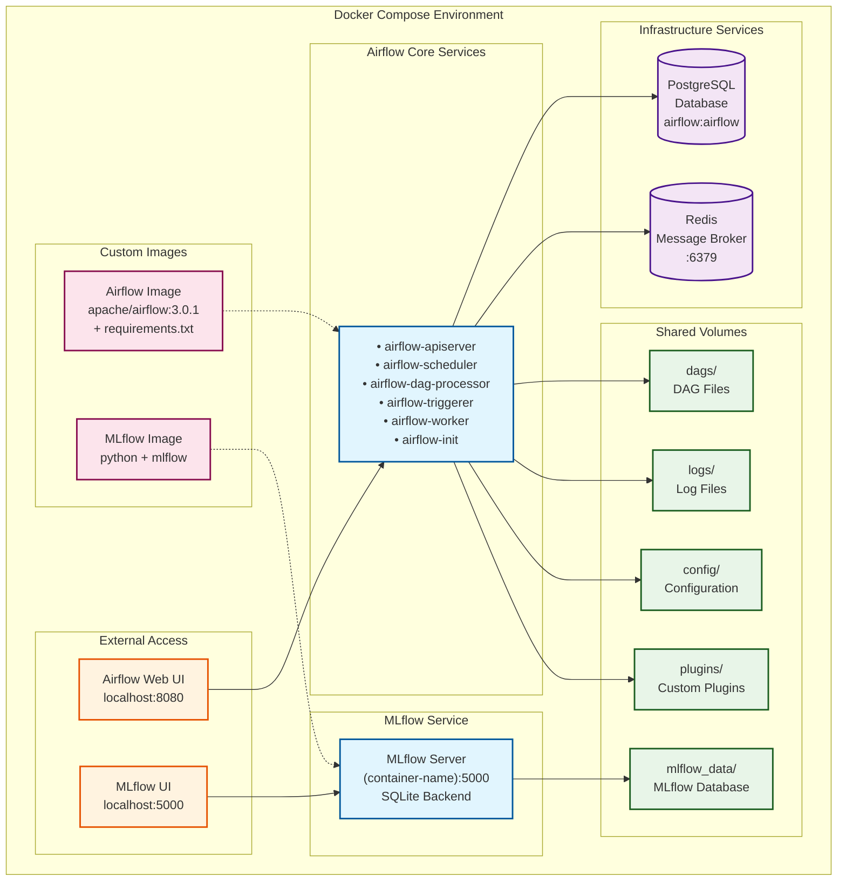

# Implementing an Airflow + MLFlow Lab

# Table of Contents

- [Implementing an Airflow + MLFlow Lab](#implementing-an-airflow--mlflow-lab)
- [Table of Contents](#table-of-contents)
	- [Installation Notes](#installation-notes)
		- [Environment:](#environment)
		- [Airflow](#airflow)
		- [MLFlow](#mlflow)
		- [Overall Architecture](#overall-architecture)
- [More detailed notes](#more-detailed-notes)
	- [Environment \& Requirements](#environment--requirements)
	- [Usage](#usage)
		- [First Run - Initializing the environment](#first-run---initializing-the-environment)
		- [Regular Usage](#regular-usage)
			- [Environment](#environment-1)
			- [Web UIs](#web-uis)
			- [Running Airflow CLI Commands](#running-airflow-cli-commands)
	- [(!In Construction!) Functional Part (!In Construction!)](#in-construction-functional-part-in-construction)
		- [About Apache Airflow](#about-apache-airflow)
		- [About MLFlow](#about-mlflow)
		- [Creating Pipelines AKA 'DAGs'](#creating-pipelines-aka-dags)
		- [Example Pipelines:](#example-pipelines)
			- [simple\_test\_dag](#simple_test_dag)
			- [orchestrated-duration-prediction-dag](#orchestrated-duration-prediction-dag)
			- [homework3-dag](#homework3-dag)


## Installation Notes
### Environment:
* Windows WSL2 - Ubuntu, with Docker and Docker Compose installed.
  * Initially 8gb allocated to WSL2, had to increase (to 12gb) since a step in my pipelines was topping up the memory and crashing the containers.
* Linux or MacOS should work easier I guess.

### Airflow

* Version: 3.0.1
* Installation method: Docker Compose referencing custom airflow.dockerfile with extra requirements.txt
* Web interface: `http://localhost:8080`
* Configuration:
	+ DAGs: 03-orchestration/dags/ directory
	+ MLFlow tracking URI: `http://03-orchestration-mlflow-1:5000`

### MLFlow

* Version: 2.22.0
* Installation method: Docker Compose referencing mlflow.dockerfile
* Web interface: `http://localhost:5000`
* Configuration:
	+ Tracking URI: `http://03-orchestration-mlflow-1:5000`
	+ Experiment name: `nyc-taxi-experiment`

### Overall Architecture



# More detailed notes

This is an Apache Airflow installation, for learning, demoing, homelab purposes.

**Context:** Created for [assignment 3 of MLOps Zoomcamp](https://github.com/DataTalksClub/mlops-zoomcamp/tree/main/03-orchestration)

## Environment & Requirements

- Started with the containerized Apache Airflow test environment provided in the oficial website:
  -  https://airflow.apache.org/docs/apache-airflow/stable/howto/docker-compose/index.html
-  Added a containerized MLFlow service in the docker compose, [as proposed in the course notes](https://github.com/DataTalksClub/mlops-zoomcamp/tree/main/03-orchestration#resources-1)
-  Added a custom dockerfile for the Airflow image to import extra python libraries (mlflow, fastparquet, pandas...) required to execute my pipelines, [as detailed in the official website.](https://airflow.apache.org/docs/apache-airflow/stable/howto/docker-compose/index.html#special-case-adding-dependencies-via-requirements-txt-file)

## Usage

### First Run - Initializing the environment

After having your prerequirements ready, make sure you follow the instructions for your first run. This is essential to ensure the relevant folders, technical users, access rights, databases... are properly configured.

Follow the instructions on: https://airflow.apache.org/docs/apache-airflow/stable/howto/docker-compose/index.html#initializing-environment

### Regular Usage

#### Environment
From the docker-compose.yaml directory:
* docker compose up 
* docker ps
* docker compose down

:) 

You should normally get something like this:
```
> docker ps --format "table {{.Names}}\t{{.Status}}\t{{.Ports}}"
NAMES                                      STATUS                 PORTS
03-orchestration-airflow-worker-1          Up 5 hours (healthy)   8080/tcp
03-orchestration-airflow-dag-processor-1   Up 2 hours (healthy)   8080/tcp
03-orchestration-airflow-triggerer-1       Up 5 hours (healthy)   8080/tcp
03-orchestration-airflow-apiserver-1       Up 5 hours (healthy)   0.0.0.0:8080->8080/tcp, :::8080->8080/tcp
03-orchestration-airflow-scheduler-1       Up 5 hours (healthy)   8080/tcp
03-orchestration-mlflow-1                  Up 5 hours             0.0.0.0:5000->5000/tcp, :::5000->5000/tcp
03-orchestration-redis-1                   Up 5 hours (healthy)   6379/tcp
03-orchestration-postgres-1                Up 5 hours (healthy)   5432/tcp
```
#### Web UIs

Access from your browser:
- **Airflow UI**: http://localhost:8080
- **MLFlow UI**: http://localhost:5000

#### Running Airflow CLI Commands

[There's a wrapper script](https://airflow.apache.org/docs/apache-airflow/stable/howto/docker-compose/index.html#running-the-cli-commands), but it wasn't working for me.

As a workaround, I simply run a shell in the Airflow Worker container and run my airflow commands from there:

```
> docker exec -it 03-orchestration-airflow-worker-1 bash
default@ef89eae34606:/opt/airflow$ airflow info

Apache Airflow
version                | 3.0.1                                                 
executor               | CeleryExecutor                           
(...)
```

## (!In Construction!) Functional Part (!In Construction!)

### About Apache Airflow

### About MLFlow

### Creating Pipelines AKA 'DAGs'

You put your adapted DAG Pipeline Python files in the DAG folder.

### Example Pipelines:

#### simple_test_dag

#### orchestrated-duration-prediction-dag

#### homework3-dag