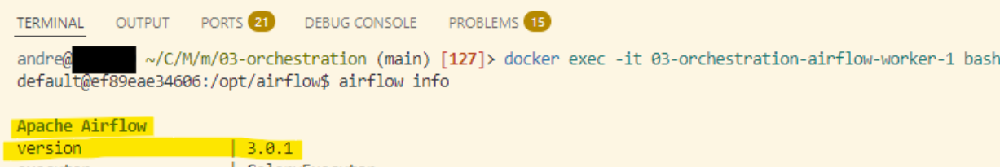
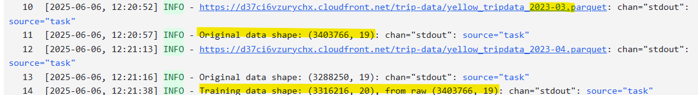
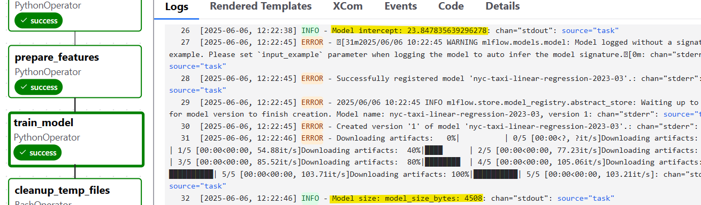

# Question 1. Select the Tool
You can use the same tool you used when completing the module, or choose a different one for your homework.
### What's the name of the orchestrator you chose?
- **Apache Airflow**          

# Question 2. Version
### What's the version of the orchestrator?
- **3.0.1**

# Question 3. Creating a pipeline
Let's read the March 2023 Yellow taxi trips data.
### How many records did we load?
- **3,403,766**

# Question 4. Data preparation
Let's apply to the data we loaded in question 3.
### What's the size of the result?
- **3,316,216**

# Question 5. Train a model
We will now train a linear regression model using the same code as in homework 1.
- Fit a dict vectorizer.
- Train a linear regression with default parameters.
- Use pick up and drop off locations separately, don't create a combination feature.

Let's now use it in the pipeline. We will need to create another transformation block, and return both the dict vectorizer and the model.

### What's the intercept of the model?
Hint: print the intercept_ field in the code block

- **24.77** _(23.847835639296278)_

# Question 6. Register the model
The model is trained, so let's save it with MLFlow.
Find the logged model, and find MLModel file. 
### What's the size of the model? (model_size_bytes field):
- **4,534** _(4508)_

